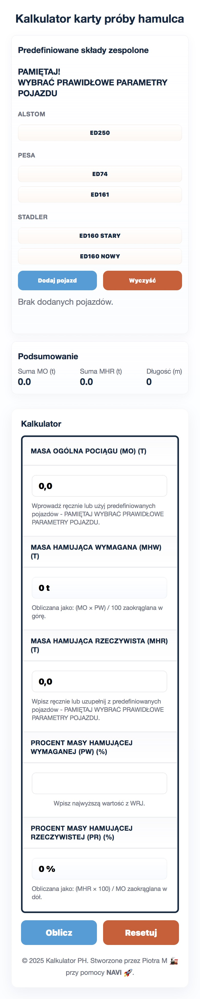

# Kalkulator Próby Hamulca (Brake Test Calculator)

Nowoczesna aplikacja webowa do obliczania wymaganej i rzeczywistej masy hamującej pociągu. Narzędzie wspiera personel kolejowy w szybkim i bezbłędnym przygotowaniu karty próby hamulca, zgodnie z przepisami obowiązującymi w Polsce (m.in. instrukcja hamulcowa PKP PLK Ir-1).

> [!NOTE]
> **[Sprawdź aplikację w działaniu](https://piotrrgw.github.io/Kalkulator_PH/)**

Podgląd strony w widoku Desktop.

Podgląd strony w widoku Mobilnym

## 🚀 Główne funkcje

*   **Zgodność z przepisami:** Algorytm obliczeniowy oparty na krajowych instrukcjach kolejowych, co minimalizuje ryzyko błędu ludzkiego.
*   **Dwa tryby pracy:**
    *   **Tryb manualny:** Ręczne wprowadzanie parametrów dla dowolnego składu pociągu.
    *   **Szablony EZT:** Baza predefiniowanych Elektrycznych Zespołów Trakcyjnych, która automatycznie uzupełnia dane techniczne pojazdu, przyspieszając pracę.
*   **Walidacja w czasie rzeczywistym:** Aplikacja na bieżąco oblicza procent masy hamującej i informuje, czy skład spełnia wymogi.
*   **Responsywność:** Interfejs dostosowany do urządzeń mobilnych (smartfony, tablety), co ułatwia pracę w terenie.

## 🛠️ Jak używać?

1.  Otwórz aplikację w przeglądarce internetowej.
2.  Wybierz tryb pracy: **Manualny** lub **Szablony EZT**.
3.  Wprowadź dane pociągu (masa, długość, masa hamująca poszczególnych pojazdów).
4.  Podaj prędkość rozkładową i rodzaj pociągu (pasażerski/towarowy).
5.  System automatycznie obliczy wymaganą i rzeczywistą masę hamującą oraz wskaże, czy warunki zostały spełnione.

## 💻 Stos technologiczny

*   **Frontend:** HTML5, CSS3, JavaScript (ES6+)
*   **Podejście:** Vanilla JS (brak zewnętrznych bibliotek i frameworków), co gwarantuje maksymalną wydajność i szybkość ładowania.

## 🤝 Wkład w projekt (Contributing)

Masz pomysł na ulepszenie aplikacji lub znalazłeś błąd? Zapraszam do tworzenia zgłoszeń (Issues) lub Pull Requestów. Każda pomoc jest mile widziana!

## 💡 Informacje o dewelopmencie

Projekt został stworzony w modelu **AI-Assisted Development**. Kluczowe elementy logiki biznesowej, struktury danych oraz interfejsu użytkownika zostały zaimplementowane przy wsparciu zaawansowanych modeli językowych.

---

> [!WARNING]
> **Nota prawna (Disclaimer)**
> Aplikacja ma charakter **pomocniczy i edukacyjny**. Mimo dołożenia wszelkich starań w celu zapewnienia zgodności z obowiązującymi przepisami, nie może ona zastąpić oficjalnej dokumentacji ani wiedzy uprawnionego pracownika. Ostateczna odpowiedzialność za prawidłowe przygotowanie pociągu i wypełnienie dokumentacji spoczywa na osobie wykonującej te czynności. Zawsze weryfikuj wyniki z oficjalnymi tabelami i instrukcjami.